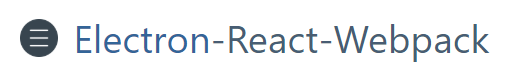

<br />
<div align="center">
    
    <div>
        Minimal boilerplate for making Desktop Applications using Electron, React and Webpack
    </div>
</div>

<br />

## Overview

After being annoyed for so many days for searching a decent, working and minimal boilerplate for writing Desktop Application using Electron and React, this project was made to make the life easier a bit.

This project makes use of `electron` with `electron-webpack` and `react` to serve the best environment for development.

<br />

## Installation

To install this boilerplate you need to run following commands

```bash
# Clone the repository on your hard drive
git clone https://gitlab.com/codesbiome/electron-react-webpack
cd electron-react-webpack

# Install dependencies using "Yarn" package manager
yarn install
```

<br />

## Development

To develop and run your application, you need to run following command

```bash
yarn dev
```

<br />

## Production - Build

To build the unpacked version of application

```bash
# Unpacked version build
yarn build
```

To build the packed (installer) version of application

```bash
# Packed version with Installer build
yarn build:setup
```

<br >

## Clean

To clean the production environment builds (files), use this command

```bash
yarn clean
```
